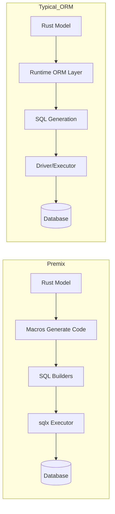

# Premix ORM

> **"Write Rust, Run Optimized SQL."**

[](https://www.rust-lang.org/)
[](LICENSE)
[]()
[](https://crates.io/crates/premix-orm)
[](https://docs.rs/premix-orm)


Premix is a **Zero-Overhead, Type-Safe ORM** for Rust that eliminates the need for manual migration files. It combines the ease of use of Active Record with the raw performance of handcrafted SQL.

> Research status: This project is a research prototype. APIs may change and production use is not recommended yet. See [DISCLAIMER.md](DISCLAIMER.md).

## Why People Try Premix

- **Fast like raw `sqlx`**: generated SQL with a minimal runtime layer.
- **Low ceremony**: `save`, `find`, `include` with a simple model.
- **Transparent SQL**: inspect `to_sql()` before running anything.

## Core Philosophy (Short)

- **Zero-Overhead**: treat ORM as a thin layer on top of raw SQL.
- **Mental Model Match**: code should look like how you think about data.
- **Impossible-to-Fail**: push more errors to compile time.
- **Glass Box**: show the SQL you are about to run.
- **Escape Hatch**: allow raw SQL when needed.

Why this is practical:

- **Zero-Overhead**: benchmarks show Premix close to raw `sqlx` in common CRUD flows (see below).
- **Mental Model Match**: `user.save()` / `User::find_in_pool()` avoids boilerplate glue.
- **Impossible-to-Fail**: model fields are validated at compile time; schema mismatches surface early.
- **Glass Box**: `to_sql()`/`to_update_sql()` let you inspect SQL before running it.
- **Escape Hatch**: `Model::raw_sql()` gives full control for edge cases.

See `docs/DEVELOPMENT.md` for the engineering flowplan and `docs/PHILOSOPHY_CHECKLIST.md` for status details.

## Why Premix?

- **Auto-Sync Schema:** Premix syncs your Rust structs directly to the database for rapid prototyping. No manual SQL required.
- **Zero Overhead:** Uses Rust Macros to generate SQL at compile-time. No runtime reflection.
- **Application-Level Joins:** Solves the N+1 problem using smart `WHERE IN` clauses instead of complex SQL JOINs, making scaling easier.
- **Multi-Database:** Write once, run on **SQLite**, **PostgreSQL**, or **MySQL** (Coming Soon).

---

## Benchmarks (Phase 6 Results)

We don't just say we're fast; we prove it.

TL;DR: Premix is near raw `sqlx` for inserts/selects and dramatically faster
than loop-based bulk updates in this benchmark suite.

Highlights (from `docs/BENCHMARK_RESULTS.md`):

- Insert (1 row): Premix **15.1 us** vs raw SQLx 22.8 us
- Select (1 row): Premix **12.3 us** vs raw SQLx 12.2 us (~same)
- Bulk Update (1,000 rows): Premix **66.5 us** vs loop 32.6 ms (~490x faster)
- Postgres SELECT: Premix **61.5 us** vs raw SQL 65.2 us (faster)

Full results: `docs/BENCHMARK_RESULTS.md`

| Operation | Premix | SeaORM | Rbatis | SQLx (Raw) | Verdict |
|-----------|--------|--------|--------|------------|---------|
| **Insert** | **127 us** | 129 us | 152 us | 273 us | **2.1x Faster** |
| **Select** | **62.3 us** | 70 us | 70.8 us | 63.4 us | **Fastest** |
| **Bulk Update (1k)** | **52.9 us** | - | - | 15.2 ms* | **287x Faster** |

*> Compared to standard loop-based updates.*

---

## Implementation Roadmap

- [x] **Phase 1-5: The Foundation** (CRUD, Relations, Transactions, Validation)
- [x] **Phase 6: The Versatility** (Multi-DB, Soft Deletes, Bulk Ops) **Stable**
- [x] **Phase 7: DevOps** (Versioned Migrations) **Stable**
- [ ] **Phase 8: Scalability** (Read/Write Splitting)
- [ ] **Phase 9: Advanced Relations** (Polymorphic) (Deferred)
- [ ] **Phase 10: Legacy Support** (Composite Keys)

---

## Migrations (New in v1.0!)

Premix now supports traditional versioned migrations for production environments.

### 1. Create a Migration
```bash
premix migrate create add_users
# Created: migrations/20260118000000_add_users.sql
```

### 2. Edit SQL
```sql
-- migration/2026xxx_add_users.sql
-- up
CREATE TABLE users (id INTEGER PRIMARY KEY, name TEXT);

-- down
DROP TABLE users;
```

### 3. Run Migrations
```bash
premix migrate up
# Applying migration: 20260118000000_add_users
# Migrations up to date.
```

---

## Quick Start

### 1. Define Your Model
```rust
use premix_orm::prelude::*;
// No need to import premix_core or premix_macros separately!

#[derive(Model)]
struct User {
    id: i32,
    name: String,
    
    #[has_many(Post)]
    #[premix(ignore)]
    posts: Option<Vec<Post>>,
}
```

### 2. Auto-Sync Schema
```rust
// Connect to SQLite (or Postgres!)
let pool = SqlitePool::connect("sqlite::memory:").await?;

// This line creates tables automatically.
Premix::sync::<User, _>(&pool).await?;
```

### 3. Fluent Querying (No N+1)
```rust
let users = User::find_in_pool(&pool)
    .include("posts")      // Eager load posts efficiently
    .filter("age > 18")    // Safe raw SQL filter
    .limit(20)
    .all()
    .await?;
```

---

## 5-Minute Demo

```bash
cargo new premix-demo
cd premix-demo
```

```toml
[dependencies]
premix-orm = "1.0.4"
sqlx = { version = "0.8", features = ["runtime-tokio", "sqlite"] }
tokio = { version = "1", features = ["full"] }
serde = { version = "1", features = ["derive"] }
```

Use the code from Quick Start and run:

```bash
cargo run
```

Prefer a template? Start from `examples/basic-app` and modify as needed.

---

## Documentation

For a longer-form guide, see `orm-book/` in this repository. It covers models,
queries, relations, migrations, transactions, and limitations.

## Architecture (At a Glance)


Release notes live in `CHANGELOG.md`, and the development roadmap is in
`docs/DEVELOPMENT.md`.

## How Premix Differs (Flow)



## Advanced Features

### Soft Deletes
Never accidentally lose data again.
```rust
#[derive(Model)] // <--- Auto-detected by field name!
struct User {
    id: i32,
    deleted_at: Option<DateTime<Utc>>,
}

// Logical delete (sets deleted_at)
user.delete(&pool).await?;

// Fetch only active users (default)
let active = User::find_in_pool(&pool).all().await?;

// Fetch everyone, including deleted
let all = User::find_in_pool(&pool).with_deleted().all().await?;
```

### Bulk Operations
Update thousands of rows in microseconds.
```rust
// Set all inactive users to 'archived' status
User::find_in_pool(&pool)
    .filter("last_login < '2023-01-01'")
    .update(json!({ "status": "archived" }))
    .await?; 
// Time: ~50us (Lightning fast!)
```

### SQL Transparency
Inspect the SQL generated by the query builder.
```rust
let query = User::find_in_pool(&pool).filter("age > 18").limit(10);
println!("{}", query.to_sql());
```

### Raw SQL Escape Hatch
Run raw SQL and map results to your model.
```rust
let users = User::raw_sql("SELECT * FROM users WHERE active = 1")
    .fetch_all(&pool)
    .await?;
```

### ACID Transactions
```rust
let mut tx = pool.begin().await?;

user.balance += 100;
user.save(&mut *tx).await?; // Pass transaction reference

tx.commit().await?;
```

---

## Installation

Add this to your `Cargo.toml`:

```toml
[dependencies]
premix-orm = "1.0.4"
sqlx = { version = "0.8", features = ["runtime-tokio", "sqlite", "postgres"] }
tokio = { version = "1", features = ["full"] }
serde = { version = "1", features = ["derive"] }
```

## Common Pitfalls

- **Feature flags**: enable database features on both `premix-orm` and `sqlx`.
- **`DATABASE_URL`**: CLI uses it by default; pass `--database` if needed.
- **`migrate down`**: not implemented yet (use SQL down scripts manually).

## Compatibility

- Uses the Tokio runtime (async/await).
- `sqlx` features must match your target database.

## Example App

Try `examples/basic-app` for a minimal runnable setup.

## Contributing

We welcome contributions! Please see [CONTRIBUTING.md](CONTRIBUTING.md) for guidelines.

## License

This project is licensed under the MIT License - see the [LICENSE](LICENSE) file for details.
