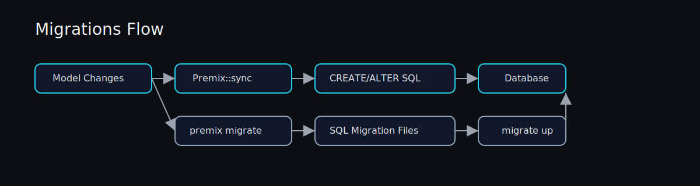

# Migrations

Premix offers two schema strategies:

1. `Premix::sync` for auto-create tables from models.
2. Versioned SQL migrations via the CLI.



## Auto Sync (Great for Prototypes)

```rust,no_run
use premix_orm::prelude::*;

#[derive(Model)]
struct User {
    id: i32,
    name: String,
}

# async fn example() -> Result<(), Box<dyn std::error::Error>> {
# let pool = Premix::smart_sqlite_pool("sqlite::memory:").await?;
Premix::sync::<premix_orm::sqlx::Sqlite, User>(&pool).await?;
# Ok(())
# }
```

This uses model-generated SQL to create tables. It is convenient for local
development and tests, but it is intentionally limited.

## Versioned SQL Migrations (Recommended for Production)

### Create a Migration

```bash
premix migrate create create_users
# migrations/20260118000000_create_users.sql
```

### Edit the SQL File

```sql
-- up
CREATE TABLE users (
  id INTEGER PRIMARY KEY,
  name TEXT NOT NULL
);

-- down
DROP TABLE users;
```

### Apply Pending Migrations

```bash
premix migrate up

# Preview pending migrations
premix migrate up --dry-run
```

### Revert the Last Migration

```bash
premix migrate down

# Preview the migration that would be reverted
premix migrate down --dry-run

# Skip confirmation prompt
premix migrate down --yes
```

### How Migrations Are Ordered

- The timestamp prefix in the file name determines ordering.
- Files are applied in ascending order.
- Applied versions are tracked in `_premix_migrations`.

## Notes and Constraints

- The CLI targets SQLite by default; pass `--database` for other engines.
- For Postgres or MySQL, build the CLI with `--features postgres` or `--features mysql` before running.
- The CLI reads `DATABASE_URL` if you do not pass `--database`.
- Migrations are applied in a single transaction when supported.
- SQLite `migrate down` may require table recreation and can cause data loss.

## Recommended Workflow

- Use `Premix::sync` in early exploration and tests.
- Switch to SQL migrations before production.
- Keep migration files under version control and review them like code.
