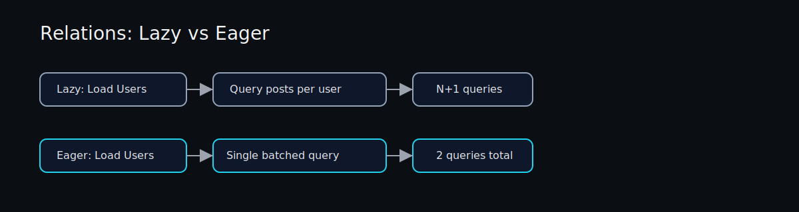

# Relations

Premix supports `has_many` and `belongs_to` relations. There are two layers:

1. Lazy relation methods generated from struct-level attributes.
2. Eager loading via `include()` on fields marked with `#[premix(ignore)]`.



## Lazy Relations (Struct Attributes)

```rust
#[derive(Model)]
#[has_many(Post)]
struct User {
    id: i32,
    name: String,
}

#[derive(Model)]
#[belongs_to(User)]
struct Post {
    id: i32,
    user_id: i32,
    title: String,
}
```

This generates:

- `user.posts_lazy(&pool).await?`
- `post.user(&pool).await?`

## Eager Loading (Field Attributes)

```rust
#[derive(Model)]
struct User {
    id: i32,
    name: String,

    #[has_many(Post)]
    #[premix(ignore)]
    posts: Option<Vec<Post>>,
}
```

Then use:

```rust
let users = User::find_in_pool(&pool)
    .include("posts")
    .all()
    .await?;
```

Premix will batch-load related rows using a `WHERE IN (...)` query.

## Avoiding N+1

Lazy loading executes one query per parent:

```rust
for user in users {
    let _posts = user.posts_lazy(&pool).await?;
}
```

Eager loading batches related rows into a single additional query:

```rust
let users = User::find_in_pool(&pool)
    .include("posts")
    .all()
    .await?;
```
